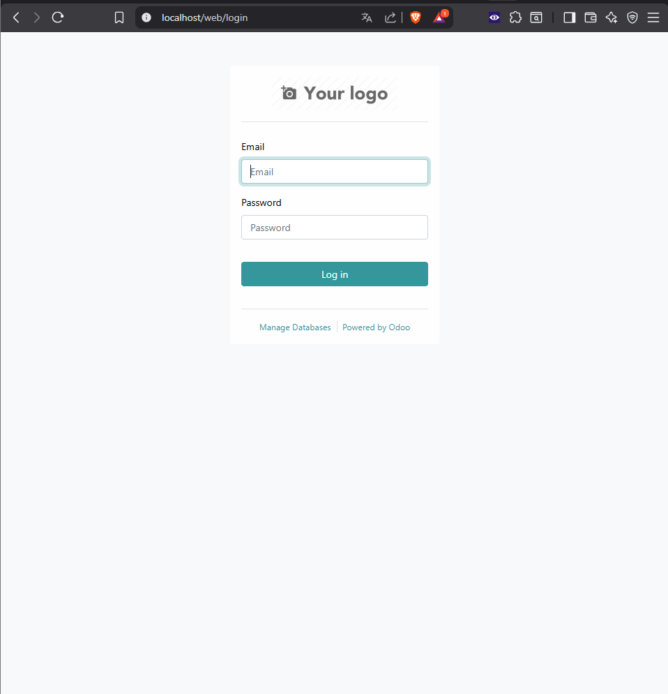

# Guía de Despliegue de Odoo 16 con Apache en Linux

**Autor:** [Gianfranco Brazzini Risco]
**Fecha:** 04/12/2025
**Asignatura:** Despliegue de Aplicaciones Web / Digitalización

---

## 1. Introducción
En esta práctica hemos desplegado un ERP Odoo versión 16 utilizando una arquitectura de tres capas:
- **Frontend:** Apache2 (Proxy Inverso en puerto 80).
- **Backend:** Odoo Server (Python en puerto 8069).
- **Base de Datos:** PostgreSQL.

## 2. Arquitectura
El usuario accede a `http://localhost`. Apache recibe la petición y la redirige internamente a `http://127.0.0.1:8069`.

## 3. Pasos realizados

### 3.1 Instalación de Prerrequisitos
Se instalaron las dependencias de Python y PostgreSQL:
`sudo apt install python3-pip postgresql ...`

### 3.2 Configuración de Base de Datos
Se creó el usuario `odoo` y `daw` en PostgreSQL.

### 3.3 Instalación de Odoo
Se clonó el repositorio oficial de Odoo 16 y se instalaron los requerimientos (`requirements.txt`) en un entorno virtual (`venv`).

### 3.4 Configuración del Proxy Inverso (Apache)
Se creó el archivo `/etc/apache2/sites-available/odoo.conf` con la configuración de `ProxyPass` para redirigir el tráfico.

## 4. Resultado Final
Como se observa en la captura, el sistema es accesible desde el puerto 80 (sin especificar puerto en la URL):

